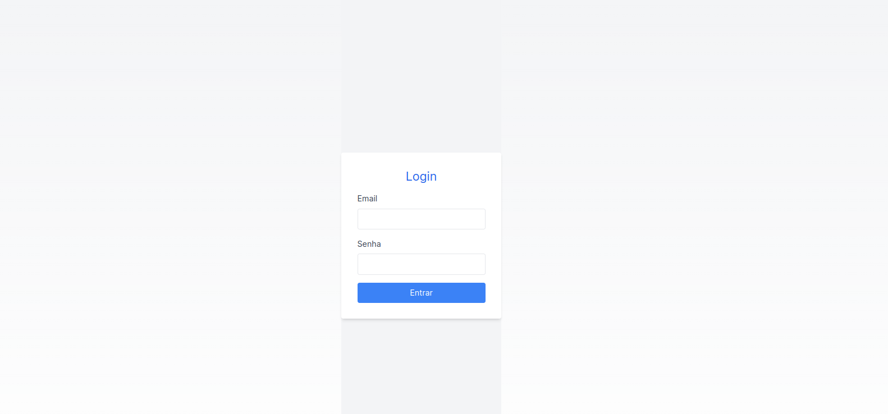
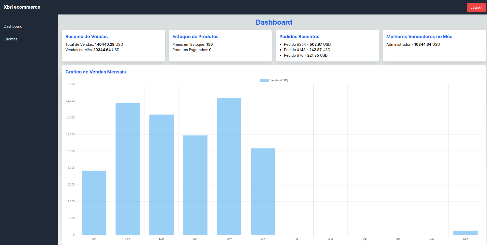
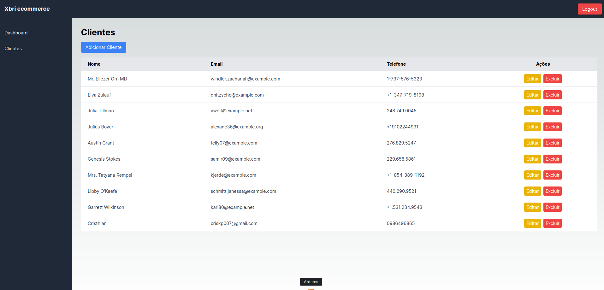
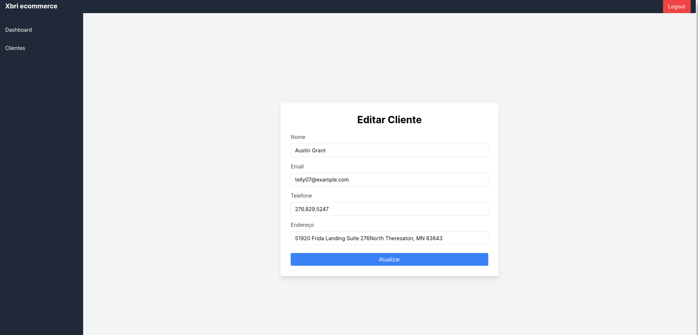

# Ecommerce de Venda de Pneus

Este é um projeto de ecommerce focado na venda de pneus. O sistema foi desenvolvido utilizando Next.js para o frontend e Laravel para o backend. O objetivo do projeto é fornecer uma plataforma eficiente para a gestão de vendas de pneus, incluindo funcionalidades como controle de estoque, pedidos, desempenho de vendedores e um dashboard intuitivo.

## Proposta do Projeto

A proposta do projeto é criar uma solução completa para a gestão de um ecommerce de pneus, com as seguintes funcionalidades principais:

- **Dashboard**: Visão geral das vendas, estoque e desempenho dos vendedores.
- **Gestão de Clientes**: Adicionar, editar e remover clientes.
- **Gestão de Produtos**: Controle de estoque e produtos esgotados.
- **Gestão de Pedidos**: Listagem e detalhes de pedidos recentes.
- **Desempenho dos Vendedores**: Acompanhamento das vendas por vendedor.
- **Autenticação**: Sistema de login e proteção de rotas para garantir a segurança dos dados.

## Funcionalidades Principais

1. **Dashboard Intuitivo**: Exibe um resumo das vendas, estoque de produtos, pedidos recentes e desempenho dos vendedores.
2. **CRUD de Clientes**: Permite a criação, edição e exclusão de clientes, com dados como nome, email, telefone e endereço.
3. **Gráficos Interativos**: Visualização das vendas mensais através de gráficos dinâmicos.
4. **Autenticação e Autorização**: Sistema de login para acesso seguro ao painel administrativo.

## Tecnologias Utilizadas

- **Next.js**: Framework React para o desenvolvimento do frontend.
- **Tailwind CSS**: Framework de CSS para estilização.
- **Chart.js**: Biblioteca de gráficos para visualização de dados.
- **Axios**: Cliente HTTP para comunicação com o backend.
- **Laravel**: Framework PHP para o desenvolvimento do backend.

## Passo a Passo para Execução do Projeto

### Requisitos

- Node.js (versão 14.x ou superior)
- NPM ou Yarn
- Backend em Laravel configurado e rodando (ver instruções específicas no repositório do backend)

### Instalação

1. **Clone o Repositório**

   ```bash
   git clone https://github.com/cristhiankelm/xbri_test_frontend.git
   cd xbri_test_frontend
   ```

2. **Instale as Dependências**

   Usando NPM:

   ```bash
   npm install
   ```

   Ou usando Yarn:

   ```bash
   yarn install
   ```

3. **Configuração do Ambiente**

   Serviço (api.ts) configurado com a url base do projeto

   ```env
   baseURL: 'http://localhost/api',
   ```

4. **Executando o Projeto**

   Usando NPM:

   ```bash
   npm run dev
   ```

   Ou usando Yarn:

   ```bash
   yarn dev
   ```

   O projeto estará disponível em `http://localhost:3000`.

   ## Estrutura do Projeto

- **/src/app**: Contém as páginas e componentes da aplicação.
- **/src/components**: Componentes reutilizáveis.
- **/src/services**: Configurações e serviços de comunicação com o backend.
- **/src/styles**: Arquivos de estilização global.
- **/docs/images**: Imagens da documentação.

   ## Rotas Principais

- **/dashboard**: Página inicial do painel administrativo com o resumo das vendas e gráficos.
- **/clients**: Listagem e gestão de clientes.
- **/login**: Página de autenticação.

## Capturas de Tela

### Página de Login



### Dashboard



### Listar Clientes



### Registrar Cliente


### Editar Cliente



## Notas

O sistema foi desenvolvido como parte de um desafio proposto pela empresa XBRI, utilizando Next.js. Este projeto marcou meu primeiro contato com a tecnologia Next.js, embora eu já tenha tido experiências anteriores com React. Decidi usar Next.js em vez de Angular para expandir meus conhecimentos no ecossistema React.

No início, enfrentei algumas dificuldades na configuração do layout e das páginas iniciais. No entanto, com muita pesquisa, tentativas e erros, consegui fazer o projeto funcionar conforme esperado. Optei por usar Axios para as requisições ao backend devido à minha familiaridade com essa biblioteca.

Espero que o sistema atenda às expectativas da empresa e que eu possa aprender ainda mais trabalhando junto com a equipe talentosa da XBRI. Estou entusiasmado com a oportunidade de contribuir para os projetos da empresa e crescer profissionalmente nesse ambiente colaborativo.